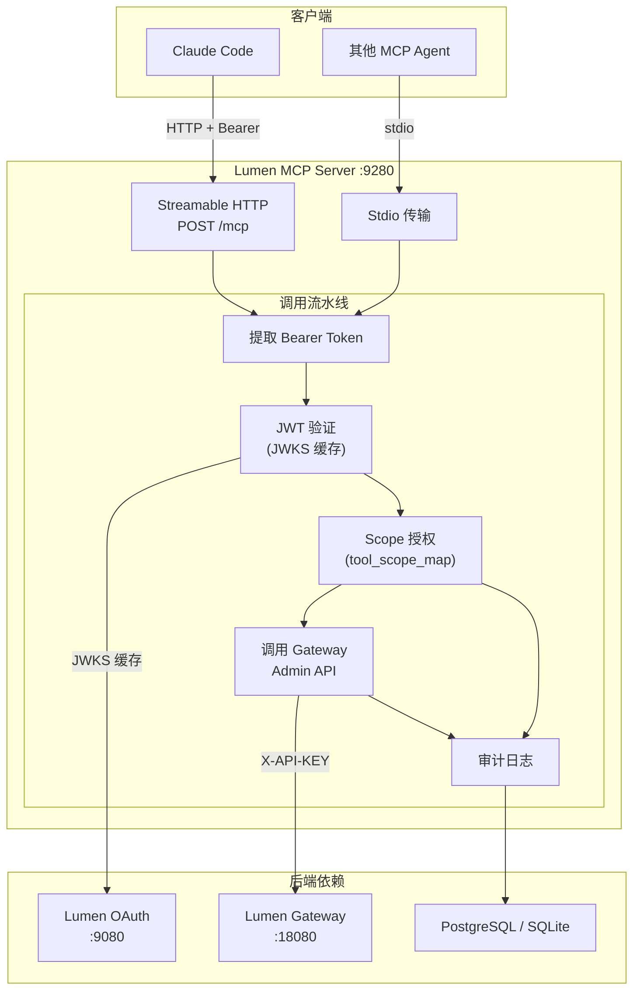
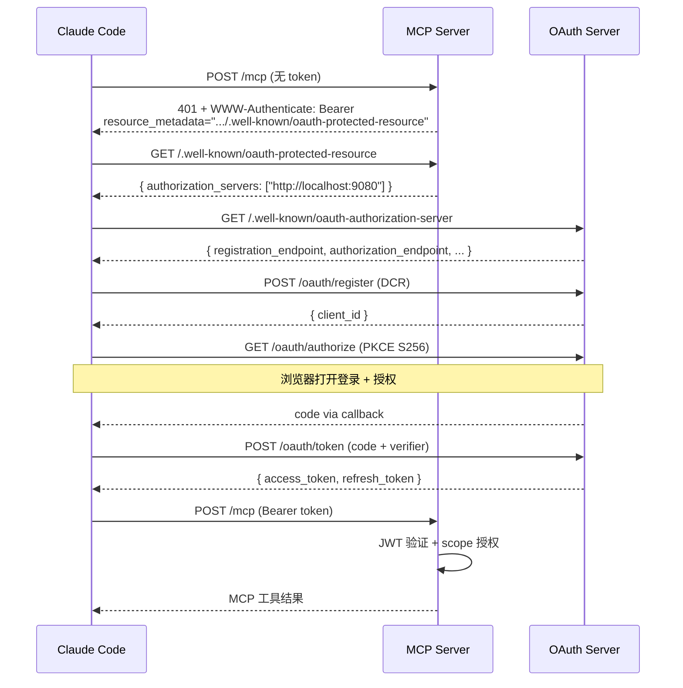
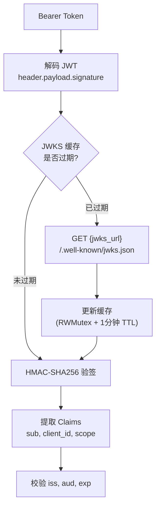
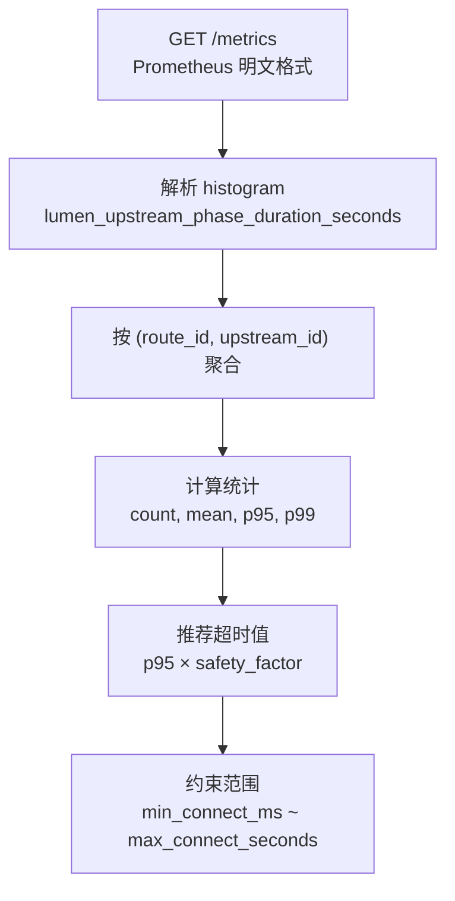
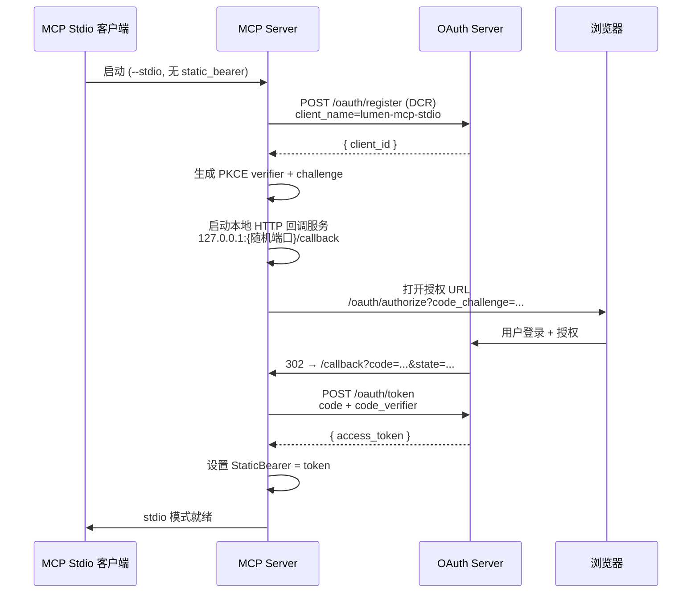

# Lumen MCP Server 技术方案

## 1. 项目背景与目标

### 1.1 项目定位

Lumen MCP Server 是一个 [Model Context Protocol](https://modelcontextprotocol.io/) (MCP) 服务器，将 Lumen Gateway 的 Admin API 暴露为 22 个 MCP 工具。支持 Streamable HTTP 和 stdio 两种传输模式，通过 OAuth 2.0 JWT 验证 + per-tool scope 授权实现安全的 AI 代理网关管理。

### 1.2 核心目标

| 目标 | 描述 |
|------|------|
| **AI 原生管理** | 22 个 MCP 工具覆盖路由、服务、上游、插件、Bundle、历史、延迟分析 |
| **OAuth 保护** | RFC 9728 Protected Resource Metadata + JWKS JWT 验证 |
| **Per-tool 授权** | 每个工具映射到所需 scope，admin:* 通配符支持超级管理员 |
| **审计追踪** | 每次工具调用记录 actor、tool、result、traceId |
| **双传输** | Streamable HTTP（Claude Code）+ stdio（其他 MCP 客户端） |

### 1.3 对标项目

| 项目 | 对比 |
|------|------|
| [Cloudflare MCP Server](https://github.com/cloudflare/mcp-server-cloudflare) | Lumen MCP 专注网关管理，内置延迟分析和超时调优 |
| [Stripe Agent Toolkit](https://github.com/stripe/agent-toolkit) | Lumen MCP 使用标准 MCP 协议而非自定义 Agent API |
| 直接调用 Admin API | MCP 提供自然语言接口，AI Agent 自动发现工具和参数 |

**核心差异化**：唯一实现了 RFC 9728 OAuth 保护的 MCP 服务器，支持 DCR + PKCE 自动授权流程，AI Agent 无需预配置 client_id 即可安全接入。

---

## 2. 整体架构

### 2.1 工具调用流水线



### 2.2 OAuth 发现与授权流程 (RFC 9728)



### 2.3 设计原则

| 原则 | 实现方式 |
|------|----------|
| **OAuth-first** | 每次调用经过 JWT 验证 + scope 授权，无硬编码权限 |
| **六边形架构** | domain / application / infrastructure / interfaces 严格分层 |
| **可插拔审计** | stdout / SQLite / PostgreSQL 三种后端，统一接口 |
| **协议标准** | MCP go-sdk、RFC 9728、RFC 7591 (DCR)、RFC 7636 (PKCE) |

---

## 3. 技术选型

### 3.1 核心依赖

| 组件 | 选型 | 版本 | 理由 |
|------|------|------|------|
| **MCP SDK** | modelcontextprotocol/go-sdk | v1.6.0 | 官方 Go SDK，支持 Streamable HTTP + stdio |
| **OAuth 客户端** | golang.org/x/oauth2 | v0.35.0 | stdio 模式浏览器登录流程 |
| **PostgreSQL** | jackc/pgx | v5.9.2 | 高性能 PG 驱动 |
| **SQLite** | modernc.org/sqlite | v1.50.1 | 纯 Go SQLite，开发环境零依赖 |
| **JSON Schema** | google/jsonschema-go | v0.4.3 | 工具输入参数 schema 定义 |
| **YAML** | gopkg.in/yaml.v3 | — | 配置文件解析 |

### 3.2 未选方案

| 方案 | 未选理由 |
|------|----------|
| 自实现 MCP 协议 | go-sdk 已成熟，维护成本低 |
| API Key 认证 | OAuth JWT 提供更细粒度的 scope 控制 |
| OpenTelemetry | 当前规模 expvar + 审计日志已足够 |

---

## 4. 核心模块设计

### 4.1 工具目录 (22 个工具)

#### 资源 CRUD

| 工具 | 功能 | 所需 Scope | Gateway 端点 |
|------|------|-----------|-------------|
| `list_routes` | 列出路由 | `read` | `GET /apisix/admin/routes` |
| `get_route` | 获取路由详情 | `read` | `GET /apisix/admin/routes/{id}` |
| `put_route` | 创建/更新路由 | `gateway:write` | `PUT /apisix/admin/routes/{id}` |
| `patch_route` | 局部更新路由 | `gateway:write` | `PATCH /apisix/admin/routes/{id}` |
| `delete_route` | 删除路由 | `gateway:write` | `DELETE /apisix/admin/routes/{id}` |
| `list_services` | 列出服务 | `read` | `GET /apisix/admin/services` |
| `put_service` | 创建/更新服务 | `gateway:write` | `PUT /apisix/admin/services/{id}` |
| `list_upstreams` | 列出上游 | `read` | `GET /apisix/admin/upstreams` |
| `put_upstream` | 创建/更新上游 | `gateway:write` | `PUT /apisix/admin/upstreams/{id}` |
| `list_plugin_configs` | 列出插件配置 | `read` | `GET /apisix/admin/plugin_configs` |
| `put_plugin_config` | 创建/更新插件配置 | `gateway:write` | `PUT /apisix/admin/plugin_configs/{id}` |
| `list_global_rules` | 列出全局规则 | `read` | `GET /apisix/admin/global_rules` |
| `put_global_rule` | 创建/更新全局规则 | `gateway:write` | `PUT /apisix/admin/global_rules/{id}` |

#### Bundle 管理

| 工具 | 功能 | 所需 Scope |
|------|------|-----------|
| `preview_import` | 预览 bundle 导入（dry run） | `gateway:write` |
| `apply_import` | 应用 bundle 导入 | `gateway:write` |
| `export_bundle` | 导出配置 bundle | `read` |

#### 历史与控制

| 工具 | 功能 | 所需 Scope |
|------|------|-----------|
| `history_list` | 配置变更历史 | `read` |
| `history_rollback` | 回滚到指定版本 | `gateway:write` |
| `get_schema` | 获取资源 schema | `read` |
| `list_plugins` | 获取插件目录 | `read` |
| `get_stats` | 获取网关统计 | `read` |

#### 延迟分析

| 工具 | 功能 | 所需 Scope |
|------|------|-----------|
| `analyze_latency` | 分析上游延迟，推荐超时值 | `read` |
| `tune_upstream_timeout` | 调优上游超时（支持 dry-run） | `gateway:write` |

### 4.2 JWT 验证与 JWKS 缓存

**文件**: `internal/infrastructure/jwkscache/verifier.go`



**缓存策略**：
- `sync.RWMutex` 保护，读多写少场景优化
- 1 分钟 TTL，过期后自动刷新
- 按 `kid` (Key ID) 索引，支持多密钥

### 4.3 Per-tool Scope 授权

**文件**: `internal/application/authorize/service.go`

**授权决策流程**：
1. 检查全局必需 scope（默认 `mcp:tools`）
2. 查询 `tool_scope_map`，获取工具所需 scope
3. Scope 匹配规则：
   - 精确匹配（不区分大小写）
   - `admin:*` 通配符匹配所有 scope（超级管理员）
   - 兼容别名：`mcp:read` / `routes:read` 满足 `read`

### 4.4 Gateway 客户端

**文件**: `internal/infrastructure/gatewayclient/http_client.go`

```go
Client {
    BaseURL: "http://gateway:18080"
    APIKey:  "local-dev-admin-key"     // X-API-KEY header
    HTTP:    &http.Client{Timeout: 15s}
}
```

**调用流程**：
```
InvokeTool(toolName, args)
  ├─ 特殊工具: analyze_latency / tune_upstream_timeout
  │  └─ 直接解析 /metrics 端点的 Prometheus 指标
  └─ 标准工具: buildRequest() → HTTP 请求 → 解析 JSON 响应
```

### 4.5 延迟分析引擎

**文件**: `internal/infrastructure/gatewayclient/latency_tools.go`



**输入参数**：

| 参数 | 默认值 | 说明 |
|------|--------|------|
| `route_id` | — | 过滤特定路由 |
| `upstream_id` | — | 过滤特定上游 |
| `min_samples` | 20 | 样本不足的系列跳过 |
| `quantile` | 0.95 | 使用 p95 作为推荐基准 |
| `safety_factor` | 3.0 | 观测延迟 × 3 = 推荐超时 |
| `min_connect_ms` | 300 | 连接超时最小值 |
| `max_connect_seconds` | 10 | 连接超时最大值 |

**`tune_upstream_timeout`** 额外支持 `dry_run` 参数：
- `true`: 仅输出推荐值，不修改配置
- `false`: 自动 PUT 更新上游超时配置

### 4.6 审计日志

**事件结构**：
```go
Event {
    At           time.Time  // 时间戳
    Actor        string     // JWT sub (用户 ID)
    ClientID     string     // OAuth client_id
    Tool         string     // 工具名
    ResourceKind string     // route / service / upstream
    ResourceID   string     // 资源 ID
    Result       string     // allow / deny / error
    TraceID      string     // X-Request-Id
    Message      string     // 错误详情或拒绝原因
}
```

**三种后端**：

| 后端 | 存储 | 适用场景 |
|------|------|----------|
| `stdout` | 内存 + 标准输出 | 开发/调试 |
| `sqlite` | 本地文件 | 单机部署 |
| `postgres` | PostgreSQL 表 | 生产环境 |

表结构：`mcp_audit_log (id, at, actor, client_id, tool, resource_kind, resource_id, result, trace_id, message)`

### 4.7 Stdio 模式 OAuth 登录

**文件**: `internal/infrastructure/oauthlogin/login.go`

针对命令行 MCP 客户端的自动 OAuth 流程：



---

## 5. HTTP 端点

### 5.1 MCP 协议

| 方法 | 路径 | 功能 |
|------|------|------|
| POST | `/mcp` | MCP Streamable HTTP 端点 (SSE) |

### 5.2 管理 API（供 Admin UI 使用）

| 方法 | 路径 | 功能 |
|------|------|------|
| GET | `/admin/tools` | 列出可用工具 |
| POST | `/admin/tools/invoke` | 调用工具（Bearer token） |
| GET | `/admin/audit` | 审计日志列表（?limit=20） |

### 5.3 发现与健康

| 方法 | 路径 | 功能 |
|------|------|------|
| GET | `/healthz` | 健康检查 |
| GET | `/.well-known/oauth-protected-resource` | RFC 9728 资源元数据 |
| GET | `/metrics` | Go 运行时指标 (expvar) |

### 5.4 中间件栈

CORS → RequestID → Recovery → AccessLog → Metrics

---

## 6. 代码结构

```
cmd/lumen-mcp-server/         入口 (--stdio 或 HTTP 模式)
internal/
├── domain/
│   ├── tool/                  工具定义
│   ├── audit/                 审计事件
│   └── policy/                授权策略
├── application/
│   ├── invoke/                工具调用（验证 → 授权 → 调用 → 审计）
│   ├── authorize/             Per-tool scope 检查
│   ├── session/               MCP 会话管理（预留）
│   └── ports/                 端口接口定义
├── infrastructure/
│   ├── gatewayclient/         Gateway Admin API HTTP 客户端
│   │   ├── http_client.go     标准工具调用
│   │   └── latency_tools.go   Prometheus 指标解析 + 延迟分析
│   ├── jwkscache/             JWKS JWT 验证 + 缓存
│   ├── auditstore/            审计日志存储（stdout / sqlite / postgres）
│   └── oauthlogin/            浏览器 OAuth 登录（DCR + PKCE）
├── interfaces/
│   ├── http/                  HTTP 处理器 + 中间件 + 路由
│   └── mcp/                   MCP 服务器（go-sdk 封装）
│       ├── server.go          工具注册 + Bearer 提取 + 调用分发
│       └── schemas.go         22 个工具的输入 JSON Schema
├── platform/                  日志、可观测性
├── config/                    配置 schema + YAML 加载
└── bootstrap/                 应用装配
```

---

## 7. 配置

```yaml
server:
  http_listen: ":9280"
  public_base_url: "http://127.0.0.1:9280"

oauth:
  issuer: "http://127.0.0.1:9080"
  audience: "http://127.0.0.1:9280/mcp"
  jwks_url: "http://127.0.0.1:9080/.well-known/jwks.json"

gateway:
  base_url: "http://127.0.0.1:18080"
  admin_api_key: "local-dev-admin-key"

auth:
  required_scopes: ["mcp:tools"]
  tool_scope_map:
    list_routes: read
    put_route: gateway:write
    analyze_latency: read
    tune_upstream_timeout: gateway:write
    # ... (22 条映射)

audit:
  backend: "postgres"              # stdout | sqlite | postgres
  postgres_url: "postgres://..."
```

---

## 8. 测试

| 测试文件 | 覆盖范围 |
|----------|----------|
| `mcp/server_test.go` | 工具注册、调用分发 |
| `invoke/service_test.go` | JWT 验证、授权、审计 |
| `authorize/service_test.go` | scope 匹配逻辑 |
| `jwkscache/verifier_test.go` | JWKS 缓存、签名验证 |
| `gatewayclient/http_client_test.go` | Gateway API 调用 |
| `gatewayclient/latency_tools_test.go` | Prometheus 解析 |
| `oauthlogin/login_test.go` | OAuth 登录流程 |
| `oauthlogin/pkce_test.go` | PKCE 生成验证 |
| `auditstore/sqlite_store_test.go` | SQLite 持久化 |
| `auditstore/postgres_store_test.go` | PostgreSQL 持久化 |
| `handlers/oauth_metadata_test.go` | RFC 9728 元数据 |

---

## 9. 关键设计决策

| 决策 | 理由 |
|------|------|
| **MCP 而非自定义 API** | 标准协议，任何 MCP 客户端可直接接入 |
| **Per-tool scope 而非全局权限** | 最小权限原则，read 工具不需要 write scope |
| **JWKS 缓存 1 分钟** | 平衡实时性和 OAuth 服务器负载 |
| **Prometheus 直接解析** | 避免引入额外查询引擎，延迟分析零依赖 |
| **审计三后端** | 开发/单机/生产各有最佳选择 |
| **DCR + PKCE 自动流程** | AI Agent 无需预配置 client_id，零手动操作 |
| **Bearer token 优先级** | Header > static_bearer，stdio 模式兼容 HTTP 模式 |

---

## 10. 未来规划

| 方向 | 计划 |
|------|------|
| **MCP 会话管理** | 持久化会话，支持 Agent 上下文恢复 |
| **工具扩展** | 添加 OAuth 管理工具（用户/客户端 CRUD） |
| **WebSocket 传输** | 替代 SSE，降低延迟 |
| **工具链式调用** | 支持 MCP 协议的 tool chaining |
| **分布式审计** | 事件发布到消息队列，支持多消费者 |
| **速率限制** | 按用户/客户端限制工具调用频率 |
| **Webhook 通知** | 配置变更时触发 webhook 回调 |
